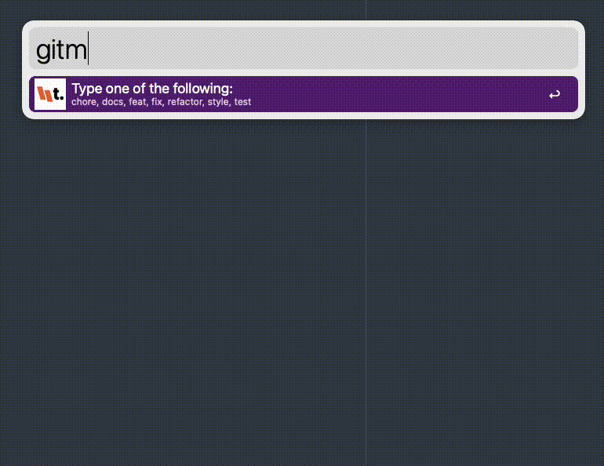

# Treestack's Alfred workflows

## Install

Download desired `.workflow` file, double click to import into Alfred.

## Workflows

### Switch audio device

[…]

### Devtools

[…]

### Gitm

Creates a fancy semantic git commit message, using emojis propsed by [https://gitmoji.dev/](https://gitmoji.dev/), and copies it to clipboard:

Example usage:

`gitm feat some fancy new feature`

[Download workflow file](./gitm/gitm.alfredworkflow)
